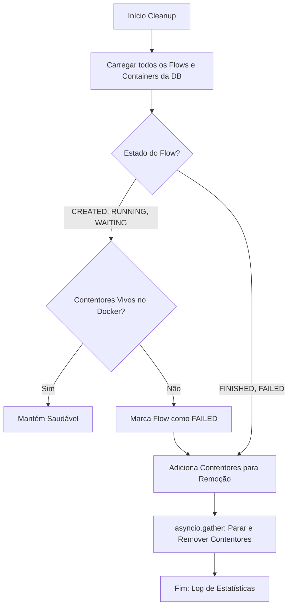

# US-018: Startup Cleanup - Docker Sandbox Finalization

## Visão Geral
A `US-018` implementa o mecanismo de limpeza automática durante o arranque do `DockerClient`. Este mecanismo garante que o estado da base de dados e a realidade dos contentores Docker estão sincronizados, prevenindo fugas de recursos após crashes ou encerramentos anómalos do sistema.

## Fluxo de Decisão (Cleanup)



*(Nota: O diagrama acima ilustra a lógica de cruzamento entre o estado esperado na DB e a existência real no Daemon Docker)*

## Decisões de Arquitetura

### 1. Paralelismo com `asyncio.gather`
A remoção de contentores Docker pode ser uma operação lenta (I/O bound). Para garantir que o arranque do sistema não seja excessivamente penalizado por uma longa lista de contentores órfãos, a remoção é processada em paralelo. Isto segue o padrão de eficiência do PentAGI original.

### 2. Idempotência
A lógica foi desenhada para ser executada múltiplas vezes sem efeitos secundários. Se um contentor já foi removido ou um Flow já está marcado como falhado, o sistema ignora graciosamente ou atualiza silenciosamente o estado para `DELETED`.

### 3. Recuperação por Nome
Em cenários onde o sistema crashou exatamente durante a criação do contentor (antes de persistir o `local_id`), o cleanup tenta localizar o contentor pelo nome determinístico gerado pelo PentestAI, garantindo que mesmo contentores "semi-criados" sejam limpos.

## Referência PentAGI
Esta implementação é a paridade funcional de `pkg/docker/client.go` (linhas 427-516) do PentAGI, adaptada para o ecossistema Python/SQLAlchemy Async.

## Como Executar os Testes

### Testes de Integração
Verificam a lógica de transição de status e a remoção física de contentores simulando desfasamentos.
```bash
pytest tests/integration/docker/test_cleanup.py -v
```

### Testes E2E
Simulam um ciclo de vida completo: criação -> trabalho -> "crash" -> recuperação via cleanup.
```bash
pytest tests/e2e/docker/test_sandbox_full_integrity.py -v
```

---
Links: [[US-017-CONTAINER-LIFECYCLE-EXPLAINED]], [[US-016-DOCKER-FILE-OPERATIONS-EXPLAINED]]
