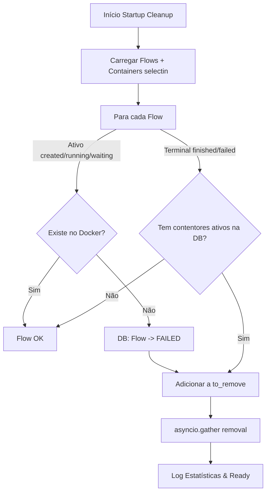

# US-018: Startup Cleanup - Docker Sandbox Finalization (Deep Dive)

## Visão Geral
A `US-018` é o componente de "higiene" do `DockerClient`. O seu propósito é garantir que, sempre que o sistema arranca ou o cliente é reiniciado, existe uma sincronização absoluta entre o que a Base de Dados (DB) acredita estar a acontecer e a realidade dos processos no daemon Docker. Isto é vital para evitar fugas de recursos (contentores órfãos) e garantir que scans interrompidos por crashes não fiquem em estados ambíguos.

## Implementação Técnica

### O Método `cleanup()`
O código abaixo reside em `src/pentest/docker/client.py` e é invocado tipicamente durante a inicialização da aplicação ou por rotinas de manutenção de integridade.

```python
# File: src/pentest/docker/client.py

async def cleanup(self) -> None:
    """Clean up orphaned containers and synchronize DB state with Docker.

    Mirrors PentAGI's cleanup logic in client.go lines 427-516.
    """
    logger.info("cleaning up containers...")
    flows = await get_flows(self._db)

    flows_failed = 0
    to_remove: list[tuple[str, int]] = []

    for flow in flows:
        # Step 1: Check active flows (CREATED, RUNNING, WAITING) for integrity
        if flow.status in (FlowStatus.CREATED, FlowStatus.RUNNING, FlowStatus.WAITING):
            if not flow.containers:
                continue

            is_healthy = True
            for container in flow.containers:
                if not container.local_id:
                    is_healthy = False
                    break
                try:
                    self._client.containers.get(container.local_id)
                except docker.errors.NotFound:
                    is_healthy = False
                    break

            if not is_healthy:
                await update_flow_status(self._db, flow.id, FlowStatus.FAILED)
                flows_failed += 1
                flow.status = FlowStatus.FAILED # Trigger removal in the next block

        # Step 2: Mark containers of terminal flows (FINISHED, FAILED) for removal
        if flow.status in (FlowStatus.FINISHED, FlowStatus.FAILED):
            for container in flow.containers:
                if container.status in (ContainerStatus.RUNNING, ContainerStatus.STARTING):
                    if container.local_id:
                        to_remove.append((container.local_id, container.id))
                    else:
                        # Fallback: tentar encontrar por nome se o local_id falhou durante o STARTING
                        try:
                            c = self._client.containers.get(container.name)
                            to_remove.append((c.id, container.id))
                        except docker.errors.NotFound:
                            await update_container_status(self._db, container.id, ContainerStatus.DELETED)

    if to_remove:
        # Deduplicação e remoção paralela
        unique_to_remove = list({(cid, dbid) for cid, dbid in to_remove})
        await asyncio.gather(
            *[self.remove_container(cid, dbid) for cid, dbid in unique_to_remove]
        )

    logger.info(
        "cleanup finished",
        extra={
            "flows_failed": flows_failed,
            "containers_removed": len(to_remove),
        },
    )
```

### Tabela de Variáveis Locais

| Variável | Tipo | Propósito |
| :--- | :--- | :--- |
| `flows` | `list[Flow]` | Lista de todos os scans (Flows) não eliminados carregados da base de dados via `get_flows`. |
| `flows_failed` | `int` | Contador de Flows que transitaram para `FAILED` devido a inconsistências detetadas. |
| `to_remove` | `list[tuple[str, int]]` | Acumulador de contentores identificados como órfãos ou desnecessários. |
| `is_healthy` | `bool` | Flag de validação que confirma se todos os contentores de um Flow ativo estão operacionais no Docker. |
| `unique_to_remove` | `list[tuple[str, int]]` | Set desduplicado para evitar chamadas de remoção redundantes ao Docker API. |

### Explicação Passo-a-Passo

1.  **Carregamento Ansioso**: O processo inicia carregando os Flows. Graças ao `lazy="selectin"` no modelo SQLAlchemy, os contentores de cada Flow são carregados de imediato, evitando múltiplas queries e erros de sessão.
2.  **Validação de Saúde**: O loop analisa Flows que deveriam estar ativos. Se a DB diz `RUNNING` mas o contentor não existe no Docker, o Flow é considerado corrompido e marcado como `FAILED`.
3.  **Deteção de Órfãos**: Qualquer Flow em estado terminal (`FINISHED`/`FAILED`) que ainda possua contentores marcados como ativos na DB é processado para limpeza.
4.  **Fallback por Nome**: Se um contentor crashou durante o `STARTING` e não chegou a gravar o seu `local_id`, o sistema usa o nome determinístico (`pentestai-terminal-{flow_id}`) para tentar encontrá-lo e eliminá-lo.
5.  **Execução Paralela**: Em vez de esperar que cada contentor seja removido sequencialmente, usamos `asyncio.gather`. Isto permite disparar todas as ordens de paragem/remoção simultaneamente, reduzindo drasticamente o tempo de startup se houver muitos resíduos.

## Deep Dive: Gestão de Sessões e Objetos Detached

Um dos problemas críticos resolvidos nesta US foi o `DetachedInstanceError`.

**O Problema**: Em Python Async, se tentarmos aceder a `flow.containers` após o contexto de `async with get_session()` ter terminado, a SQLAlchemy lança uma exceção porque a sessão que deveria carregar os dados já não existe.

**A Solução**: Implementámos **Carregamento Ansioso (Eager Loading)** via `selectinload`. No modelo `Flow` em `src/pentest/database/models.py`, a relação é definida como:
`containers: Mapped[list["Container"]] = relationship(..., lazy="selectin")`.

Isto significa que no momento em que os Flows são carregados, a SQLAlchemy executa uma segunda query optimizada para trazer todos os contentores relacionados de uma vez. Quando o `DockerClient.cleanup()` itera sobre os flows, os dados já estão em memória, tornando o processo seguro mesmo fora do contexto da query original.

## Diagrama de Fluxo (Cruzamento DB vs Docker)



## Referência PentAGI
Este módulo é a evolução direta da lógica em Go do PentAGI (`pkg/docker/client.go`).
- **Paridade**: Mantivemos a lógica de marcar como falhado flows órfãos.
- **Melhoria**: Substituímos o uso de `sync.WaitGroup` e loops manuais por `asyncio.gather`, que é mais idiomático e eficiente em Python para operações I/O bound de rede/socket.

## Related Notes
- [[US-017-CONTAINER-LIFECYCLE-EXPLAINED]] - Base da gestão de stop/remove.
- [[US-013-DOCKER-CLIENT-EXPLAINED]] - Contexto da inicialização do cliente.
- [[PROJECT-STRUCTURE]] - Organização dos módulos.
- [README.md](../../../README.md) - Visão geral do sistema.
